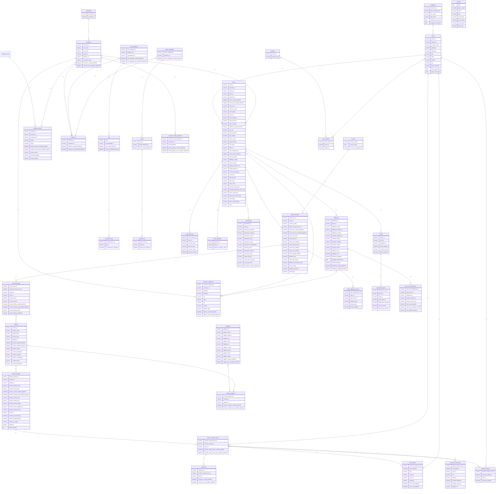

# Universal Commerce Schema

**Work in Progress**

```mermaid
erDiagram
    orders ||--o{ order_line_items : "1..*"
    order_line_items ||--o{ product_listings : "1..*"
    product_listings }o--|| products : "1..*"
    product_variant_stores ||--o{ inventory_history : "1..*"
    product_variant_stores ||--o{ price_history : "1..*"
    stores ||--o{ orders: "1..*"
    stores ||--o{ inventory_history: "1..*"
    stores ||--o{ price_history: "1..*"
    product_variant_stores ||--o{ inventory_cost_history : "1..*"
    product_variant_stores ||--o{ collections : "1..*"
    products ||--o{ product_variants : "1..*"
    product_variants ||--o{ product_variant_stores : "1..*"
    stores ||--o{ product_variant_stores : "1..*"
    product_stores ||--o{ product_reviews : "1..*"
    customers ||--o{ orders : "1..*"
    households ||--o{ customers : "1..*"
    customers ||--o{ product_reviews : "1..*"
    customers ||--o{ customer_addresses : "1..*"
    suppliers }o--o{ product_suppliers : "*..*"
    products }o--o{ product_suppliers : "*..*"
    customers }o--o{ audiences : "*..*"
    ad_campaigns }o--|| audiences : "*..1"
    ad_campaigns ||--o{ ads : "1..*"
    ads ||--o{ ad_impressions : "1..*"
    email_campaigns }o--|| audiences : "*..1"
    email_campaigns ||--o{ emails : "1..*"
    emails ||--o{ emails_sent : "1..*"
    customers ||--o{ customer_email_addresses : "1..*"
    currency ||--o{ order_line_items : "1..*"
    markets }o--o{ store_markets : "*..*"
    stores }o--o{ store_markets : "*..*"
    orders }o--o{ customer_addresses : "*..*"
    employees ||--o{ stores: "1..*"
    orders ||--o{ order_discounts: "1..*"
    order_line_items ||--o{ order_shipping_services: "1..*"
    orders ||--|| order_payments: "1..1"
    orders ||--o{ transactions: "1..*"
    orders ||--o{ refunds: "1..*"
    refunds ||--o{ refund_line_items: "1..*"
    orders ||--o{ fulfillments: "1..*"
    fulfillments }o--o{ customer_addresses: "*..*"
    fulfillments ||--o{ order_item_fulfillments: "1..*"


    orders {
        varchar order_id
        varchar customer_id
        varchar market_id
        varchar store_id
        varchar payment_id
        datetime order_created_datetime
        datetime order_last_modified_datetime
        decimal order_total
        varchar currency_name
        varchar order_status
        decimal order_tax
        decimal order_shipping
        decimal order_discount
        decimal order_subtotal
        decimal platform_commission_fees
        decimal tax_rate
        decimal refund_amount
        decimal total_weight
        varchar order_source
        varchar sales_channel
        varchar cart_token
        varchar email_id
        varchar store_employee_id
        datetime order_cancel_datetime
        varchar financial_status
        varchar fulfillment_status
        varchar cancel_reason
        varchar shipping_address_id
        varchar billing_address_id
        varchar customer_language
        varchar browser_ip
        varchar referring_site
        varchar order_tags
        varchar order_notes
        boolean business_order_flag
        boolean expedited_shipping_order_flag
        boolean prime_order_flag
        boolean replacement_order_flag
        boolean refund_flag
        boolean taxes_included_flag
        varchar notes
    }
    order_line_items {
        varchar order_item_id
        varchar order_id
        varchar currency_name
        varchar product_variant_store_id
        datetime order_item_created_datetime
        datetime order_item_last_modified_datetime
        decimal order_item_price
        decimal order_item_tax
        decimal order_item_shipping
        decimal order_item_discount
        decimal order_item_subtotal
        decimal order_item_quantity
        decimal order_quantity_fulfilled
        decimal product_cost
        varchar order_item_status
        decimal platform_commission_fees
        boolean gift_card_flag
        boolean shipped_item_flag
        boolean refund_flag
    }
    order_payments {
        varchar payment_id 
        varchar order_id
        varchar payment_gateway_name   
    }    
    transactions {
        varchar transaction_id
        varchar order_id 
        datetime transaction_datetime
        varchar transaction_gateway
        varchar transaction_source
        varchar transaction_type
        varchar transaction_status
        varchar transaction_authorization
        varchar currency_name
        decimal transaction_amount
        varchar avs_result_code
        varchar credit_card_bin
        varchar credit_card_company
        varchar cvv_result_code
        datetime transaction_created_datetime  
    }
    fulfillments{
        varchar fulfillment_id
        varchar order_id
        varchar fulfillment_status
        varchar fulfillment_location_id
        varchar fulfillment_location
        varchar customer_address_id
        varchar shipment_status
        varchar tracking_company
        varchar tracking_number
        varchar currency_name
        decimal fulfillment_cost
        decimal shipping_cost
        datetime fulfillment_datetime
        date estimated_arrival_date
        datetime delivery_datetime
        datetime fulfillment_created_datetime
        datetime fulfullment_updated_datetime
    }
    order_item_fulfillments{
        varchar order_item_fulfillment_id
        varchar order_item_id
        varchar fulfillment_id
        varchar product_variant_id
        varchar product_variant_sku
        decimal order_item_quantity
        decimal order_item_quantity_to_fulfill
        varchar item_fulfillment_status 
    }
    refunds {
        varchar refund_id
        varchar order_id
        varchar employee_id
        datetime refund_datetime
        varchar currency_name
        decimal refund_amount
    }
    refund_line_items{
        varchar refund_line_item_id
        varchar refund_id
        varchar order_id
        varchar order_item_id
        decimal refund_item_quantity
        decimal refund_amount
        decimal refund_tax_amount   
    }
    product_listings {
        varchar product_list_id
        varchar product_variant_store_id
        varchar market_id
        varchar store_id
        decimal product_price
        varchar currency_name   
        datetime product_listing_created_datetime
        datetime product_listing_last_modified_datetime
        varchar product_listing_status
        varchar product_listing_description
    }
    products {
        varchar product_id
        varchar product_name
        varchar product_type
        varchar product_tags
        varchar supplier_id
        datetime product_created_datetime
        datetime product_modified_datetime
        varchar product_status
        varchar product_description
        varchar product_category
        varchar product_subcategory
        varchar product_brand
        varchar product_department
    }
    product_variants {
        varchar product_variant_id
        varchar product_id
        varchar supplier_id
        varchar product_variant_name
        varchar product_variant_sku
        datetime product_variant_created_datetime
        datetime product_variant_last_modified_datetime
        varchar product_variant_color
        varchar product_variant_size
        varchar product_variant_weight
        varchar product_variant_weight_unit
        varchar product_variant_status
        varchar barcode
        boolean inventory_tracked_flag
        boolean requires_shipping_flag 
        varchar country_of_origin
        varchar image_url
        int image_position
    }
    inventory_history {
        varchar product_variant_store_id
        datetime inventory_datetime
        varchar store_id
        decimal inventory_quantity
    }
    price_history {
        varchar product_variant_store_id
        datetime price_datetime
        decimal price 
        varchar currency
        varchar store_id
        varchar market_id
        datetime price_start_datetime
        datetime price_end_datetime
    }
    stores {
        varchar store_id
        varchar market_id
        varchar location_name
        varchar address1
        varchar address2
        varchar city
        varchar state
        varchar country
        varchar zip
        varchar phone_number  
        date store_open_date
        date store_close_date
    }
    inventory_cost_history {
        varchar product_variant_store_id
        datetime cost_datetime
        varchar store_id
        decimal cost
        varchar currency
        datetime received_datetime
        decimal quantity_received
        varchar supplier_id
    }
    collections {
        varchar collection_id
        varchar product_variant_store_id
        varchar store_id
        datetime collection_created_datetime
        datetime collection_last_modified_datetime
    }
    product_variant_stores {
        varchar product_variant_store_id
        varchar product_variant_id
        varchar store_id
        datetime product_variant_store_created_datetime
        datetime product_variant_store_last_modified_datetime
    }
    product_reviews {
        varchar review_id
        varchar product_id
        varchar customer_id
        varchar review
        decimal rating
        datetime product_review_created_datetime
        datetime product_review_last_modified_datetime
        varchar review_status
        varchar review_language
        varchar review_market
    }
    customers {
        varchar customer_id
        varchar first_name
        varchar last_name
        varchar email_id
        varchar address_id
        varchar customer_status
        datetime customer_created_datetime
        datetime customer_last_modified_datetime
    }
    customer_addresses {
        varchar customer_address_id
        varchar customer_id
        varchar address1
        varchar address2
        varchar city
        varchar state
        varchar zip
        varchar country
        varchar address_type
        datetime address_created_datetime
        datetime address_last_modified_datetime
    }
    suppliers {
        varchar supplier_id
        varchar supplier_name
        varchar supplier_address
        varchar supplier_city
        varchar supplier_state
        varchar supplier_zip
        varchar supplier_country
        varchar supplier_phone
        varchar supplier_email
        varchar supplier_status
        datetime supplier_created_datetime
        datetime supplier_last_modified_datetime
    }
    audiences {
        varchar audience_id
        varchar customer_id
        datetime audience_created_datetime
        datetime audience_last_modified_datetime
    }
    ad_campaigns {
        varchar ad_campaign_id
        varchar audience_id
        varchar ad_platform_id
        datetime ad_campaign_created_datetime
        datetime ad_campaign_last_modified_datetime
    }
    ads {
        varchar ad_id
        varchar ad_campaign_id
        datetime ad_created_datetime
        datetime ad_last_modified_datetime
    }
    ad_impressions {
        varchar ad_impression_id
        varchar ad_id
        datetime ad_impression_datetime
    }
    email_campaigns {
        varchar email_campaign_id
        varchar audience_id
        datetime email_campaign_created_datetime
    }
    emails {
        varchar email_id
        varchar email_campaign_id
        datetime email_created_datetime
    }
    emails_sent {
        varchar email_sent_id
        varchar email_id
        datetime email_sent_datetime
    }
    customer_email_addresses {
        varchar customer_email_address_id
        varchar customer_id
        varchar email_address
        datetime email_address_created_datetime
        datetime email_address_last_modified_datetime
    }
    calendar{
        date date
        varchar day_of_week
        varchar month
        varchar year
        varchar fiscal_week
        varchar fiscal_month
        varchar fiscal_quarter
        varchar fiscal_year
    }
    currency{
        varchar currency_name
        date currency_date
        decimal currency_exchange_rate
    }
    markets {
        varchar market_id
        varchar market_name
    }
    store_markets {
        varchar store_market_id
        varchar store_id
        varchar market_id
    }
    product_suppliers { 
        varchar product_supplier_id
        varchar product_id
        varchar supplier_id
        datetime product_supplier_created_datetime
        datetime product_supplier_last_modified_datetime
    }
    households {
        varchar household_id
        varchar customer_id
    }
    employees {
        varchar employee_id
        varchar store_employee_id
        varchar first_name
        varchar last_name  
        date employee_start_date
        date employee_end_date
    }
    order_discounts{
        varchar order_discount_id
        varchar order_id
        varchar discount_code
        varchar discount_type
        varchar currency_name
        decimal discount_amount  
    }
    order_shipping_services{
        varchar order_shipping_line_id
        varchar order_id
        varchar order_item_id
        varchar shipping_code
        varchar shipping_title 
        varchar carrier_identifier     
    }
```

